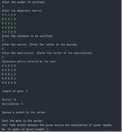
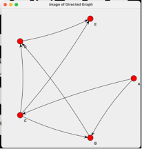
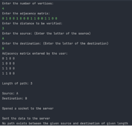
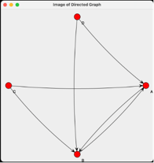
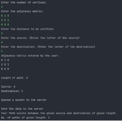
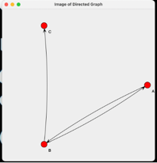

# Java Socket Programming

## Problem Statement
Write a program that involves a client and a server. The client sends server 4 values, for example X, n, B, C where, X is the adjacency matrix of a directed graph with m nodes  (let’s say 5 nodes: A B C D E), and n is the length of the path from node B to node C.
The server responds back with two responses:

i.	Positive Y response (or Negative N response) if there exists (or doesn't exist) a path of length n from B to C.
ii.	The image of the directed graph with nodes proving the validity of the response.

## Implementation
[JUNG](http://jung.sourceforge.net/) library is used to implement the graph. The client sends the server the adjacency matrix and the length of the path to be verified along with the nodes. The server sends back the response and the image to be rendered by the client back to it.
Install the library from Maven Central or manually add the dependency to the pom.xml file.

## Sample Input and Output

- **Sample Case 1:**

 

- **Sample Case 2:**

- **Sample Case 3:**

